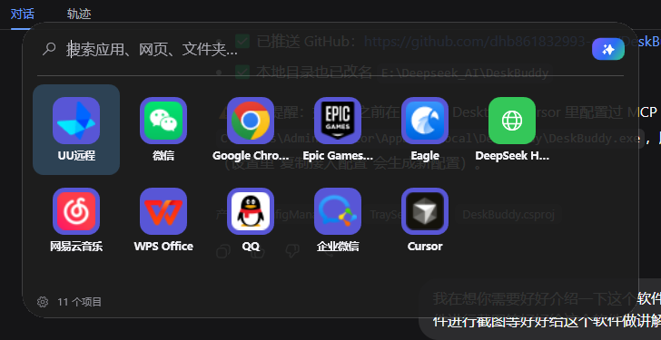
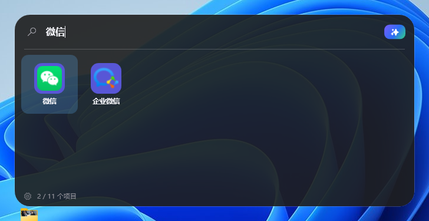
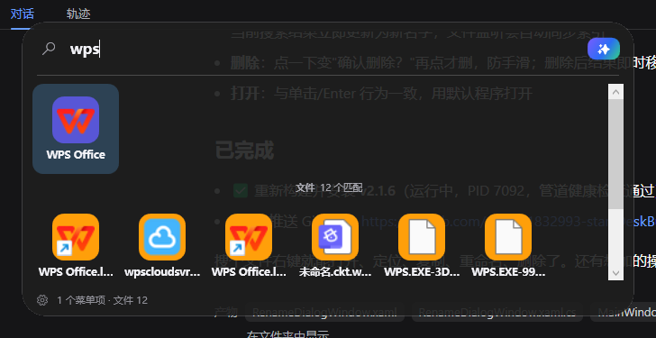
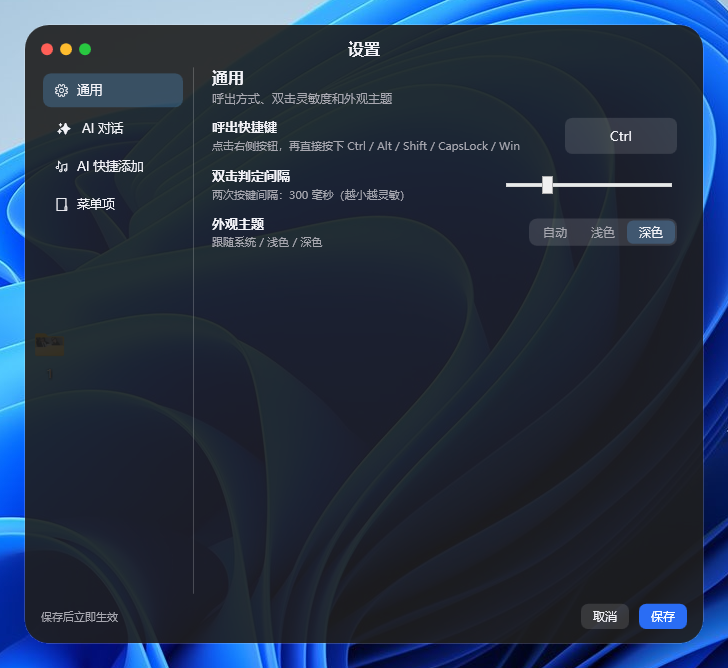
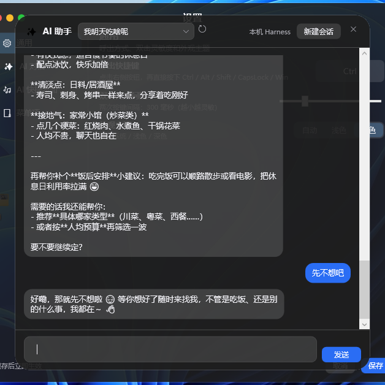

<p align="center">
  
</p>

<h1 align="center">🤖 DeskBuddy</h1>

<p align="center">
  <b>macOS 风格的 Windows 桌面伙伴</b> —— 双击一下，一键呼出。<br/>
  像手机桌面一样管理，像 Spotlight 一样搜索，问不到的交给 AI。
</p>

<p align="center">
  
  
  
  
  <a href="https://github.com/dhb861832993-star/DeskBuddy/releases">
    
  </a>
</p>

<p align="center">
  <b>自包含单文件 exe · 免装 .NET 运行时 · 复制即用 · Inno Setup 安装包</b><br/>
  连续快速双击热键（默认 <code>Ctrl</code>）立即唤出图标宫格菜单，比翻桌面、找开始菜单快得多。
</p>

---

## 🚀 一句话介绍

**DeskBuddy** 是一个运行在 Windows 上的「超级快捷启动器 + 文件搜索 + AI 助手」二合一工具：

- ⌨️ **双击 Ctrl 呼出**手机桌面式的图标宫格，单击即开程序 / 网页 / 文件夹
- 🔍 **实时搜索**：中文、拼音、路径都能搜，还能**秒搜全盘文件**（自有 USN 引擎，不依赖 Windows Search）
- 🤖 **内置 AI 对话**：直连本机 DeepSeek Harness，搜不到的问 AI
- 📝 **备忘录**：随手记录待办，勾选完成自动归档
- 🔧 **MCP 接入**：让 Claude / Cursor 等 AI 工具直接帮你管理快捷菜单

---

## 🖼️ 界面一览

### 主菜单 —— 双击热键，图标宫格一键出现
<p align="center"></p>

### 实时搜索 —— 输入即过滤，还能同时搜电脑文件
<p align="center"></p>

### 文件搜索 —— 自有 USN 引擎，千万级文件秒搜
<p align="center"></p>

### 设置窗口 —— macOS 系统设置风格，左侧目录栏
<p align="center"></p>

### AI 对话 —— 直连本机 DeepSeek Harness
<p align="center"></p>

---

## ✨ 功能特性

| 功能 | 说明 |
| --- | --- |
| ⌨️ **双击热键呼出** | 默认双击 `Ctrl`，可改 Alt / Shift / CapsLock / Win；间隔可调 |
| 🖱️ **单击即开** | 点击任意图标直接启动；已打开的程序（含托盘隐藏）**只弹出不重复启动** |
| 🍎 **苹果风 UI** | 圆角卡片 + 亚克力毛玻璃，浅色/深色自动跟随系统 |
| 🔍 **实时搜索** | 中文、拼音、路径关键词过滤；`↑↓←→` 选择，`Enter` 打开 |
| 🗂️ **自有 USN 文件引擎** | 读 NTFS USN 日志独立建索引（Listary 同技术），**不依赖 Windows Search**，千万级文件秒搜；首次构建数十秒，之后毫秒级 |
| 🤖 **AI 对话** | 默认**本机 Harness** 零配置对话（流式输出、工具状态、授权/提问）；也支持 OpenAI 兼容 API |
| 📝 **备忘录** | 右侧独立面板随手记录待办，双击编辑、勾选完成自动归档到历史，可搜索/恢复/清空 |
| 🧩 **五种条目类型** | `app` 程序 / `url` 网页 / `folder` 文件夹 / `file` 文件 / `command` 命令 |
| 📦 **自动提取图标** | 程序条目自动提取 exe 图标；AI 智能启动（服务在跑→开页面，没跑→脚本拉起） |
| 🖱️ **拖拽添加** | 从桌面/资源管理器把文件、快捷方式、文件夹、网址拖进菜单，自动识别类型 |
| 🔧 **MCP 接入** | 内置 MCP 服务，Claude / Cursor / Cherry Studio 可直接查看/添加/删除快捷菜单 |
| ⚙️ **图形化设置** | 左侧目录栏：快捷键、双击间隔、主题、AI、MCP、菜单项管理，保存即生效 |
| 🖱️ **系统托盘** | 右键托盘：设置 / 编辑配置 / 重新加载 / 开机自启 / 退出 |
| 📄 **JSON 配置** | 高级选项手改 JSON，热加载自动生效 |

---

## 📥 快速安装

> ⬇️ **[Releases 页面](https://github.com/dhb861832993-star/DeskBuddy/releases)** 提供 `DeskBuddy-Setup.exe`（安装包）与 `DeskBuddy.exe`（绿色版）。

| 方式 | 做法 |
| --- | --- |
| ✅ **安装包（推荐）** | 运行 `DeskBuddy-Setup.exe`，一路下一步，可选开机自启 / 桌面快捷方式 |
| 📦 **便携版** | 双击 `installer/安装DeskBuddy.bat`，自动装到 `%LOCALAPPDATA%\DeskBuddy` 并注册自启 |
| 🟢 **绿色直用** | 复制 `DeskBuddy.exe` 到任意位置双击运行，首次自动生成配置 |

---

## 🎮 使用速览

1. **双击 Ctrl** → 菜单从屏幕上方弹出
2. 输入关键字过滤，或 **单击图标直接打开**
3. `↑↓←→` 选择，`Enter` 打开；`Esc` 退出
4. 想要更多：**拖文件/快捷方式**到菜单上 → 自动加进来
5. 搜不到？菜单里点 **「✨ 用 AI 回答」** → 直接问 AI

---

## 🗂️ 文件搜索：强大的自有引擎

在 **设置 → 搜索** 里开启并指定范围（可多盘、支持环境变量）：

- **自有 USN 引擎（v2.3 新增）**：通过 NTFS USN 日志独立建索引，**完全不依赖 Windows Search**——即使系统索引损坏/禁用也能秒搜千万级文件；与 Listary 同技术路线
- **搜索后端可选**：`auto`（USN → Windows Search → 内置）/ `usn` / `wsearch` / `builtin`
- **毫秒级返回 + 实时更新**：新建/删除/改名几秒内自动同步，不做全盘重建
- **自动加索引范围**：大目录首次加入时自动注册，右下角显示索引进度条
- **文件右键**：打开 / 打开所在目录 / 复制路径 / 重命名 / 删除

---

## 📝 备忘录：随手记，勾完归档

菜单底部「📝」或右侧面板，随手记录待办：

- 输入框回车 / 点「添加」记一条
- **单击圆圈**标记完成 → 自动归档到「已完成」
- **双击**条目行内编辑，回车 / ✓ 保存，ESC 取消
- 顶部可**搜索过滤**；已完成可**展开查阅 / 恢复 / 清空**
- 自动保存到 `DeskBuddy.memo.json`，并保留 `.bak` 备份

---

## 🤖 AI 对话

默认**本机 Harness 模式**：直接对话本机运行的 [DeepSeek Harness](https://github.com/deepseek-ai) agent（零配置，无需 API 密钥）。

- 呼出菜单 → 点搜索框右侧彩色 **✨** → 打开 AI 对话窗口
- **流式输出**，实时显示 agent 状态（🧠 思考 / 🔧 工具调用 / ⏳ 步骤 / ✅ 完成）
- agent 需要授权/提问时出现操作条
- 也可切换 **OpenAI 兼容 API**（默认 DeepSeek 官方）

---

## 🔧 MCP：让 AI 帮你管理菜单

内置 **MCP 服务**（默认开启，仅本机），任何支持 MCP 的 AI 工具都能直接：

- `list_menu_items` — 查看条目
- `add_menu_item` — 添加条目（name / type / path / args / keywords / icon）
- `remove_menu_item` — 按名称删除

接入方式：`DeskBuddy.exe --mcp`（stdio）。设置里有「一键复制客户端配置」按钮。

```json
// example: claude_desktop_config.json
{
  "mcpServers": {
    "deskbuddy": {
      "command": "C:\\Users\\<用户名>\\AppData\\Local\\DeskBuddy\\DeskBuddy.exe",
      "args": ["--mcp"]
    }
  }
}
```

---

## 🛠️ 自行构建

需要 [.NET 8 SDK](https://dotnet.microsoft.com/download/dotnet/8.0)（Windows 10/11）。

```powershell
# 一键发布（自包含单文件 exe → dist\app）
.\build.ps1

# 制作安装包（需 Inno Setup 6）
"C:\Program Files (x86)\Inno Setup 6\ISCC.exe" .\installer\DeskBuddy.iss
```

---

## ❓ 常见问题

<details>
<summary><b>双击 Ctrl 没反应？</b></summary>

可能与其他软件（输入法、快捷键工具）冲突。打开设置窗口，把快捷键改为 `CapsLock` 或 `Alt` 即可。
</details>

<details>
<summary><b>提示找不到程序？</b></summary>

把 `path` 写成完整路径，例如 `"C:\\Program Files\\Google\\Chrome\\Application\\chrome.exe"`。
</details>

<details>
<summary><b>点菜单项弹出了新登录界面（如微信）？</b></summary>

不会——DeskBuddy 检测到程序已在运行（含托盘隐藏），只会把它弹出到前台，不重复启动。
</details>

<details>
<summary><b>开机自启勾选后没生效？</b></summary>

自启写入当前用户注册表（`HKCU\...\Run`），无需管理员。若被杀软拦截请允许。
</details>

<details>
<summary><b>换电脑 / 绿色分发？</b></summary>

自包含 exe 无任何运行时依赖，复制 `DeskBuddy.exe` + `DeskBuddy.config.json` 即可。
</details>

---

## 🏗️ 技术说明

- **.NET 8 / C# / WPF**（WinForms 仅用于托盘图标），自发布 `PublishSingleFile` + 压缩，约 66 MB
- **全局低级键盘钩子**（`WH_KEYBOARD_LL`）实现双击检测，自动过滤按住重复
- **自有 USN 索引引擎**：直读 NTFS MFT / USN 日志，内存索引 + 前 2 字符前缀桶，毫秒级匹配
- `SetWindowCompositionAttribute` 实现 Win10/11 亚克力毛玻璃，失败自动回退半透明
- 单实例通过命名 Mutex + EventWaitHandle 通信
- MCP 服务基于官方 `ModelContextProtocol` SDK

---

<p align="center">
  Made with ❤️ · 双击 Ctrl，马上开始～
</p>